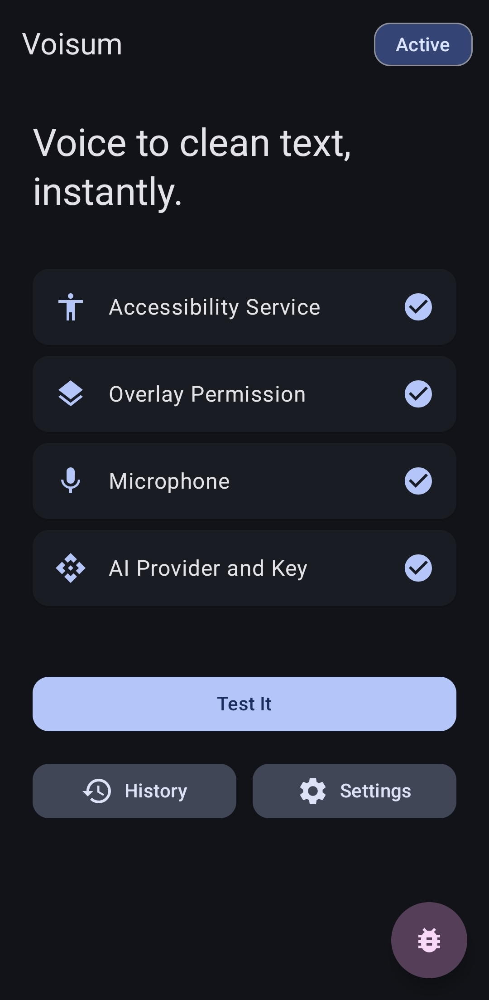
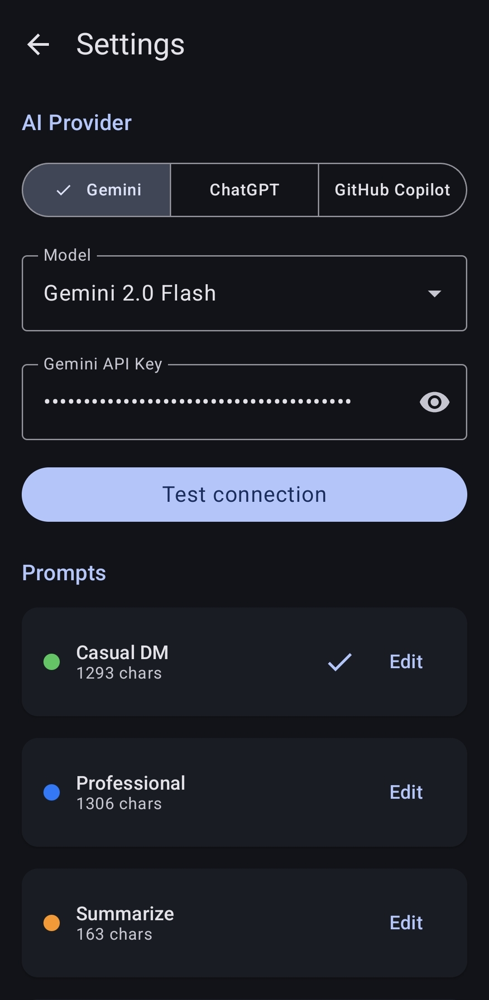
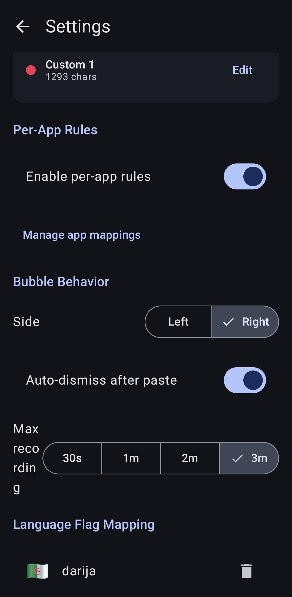
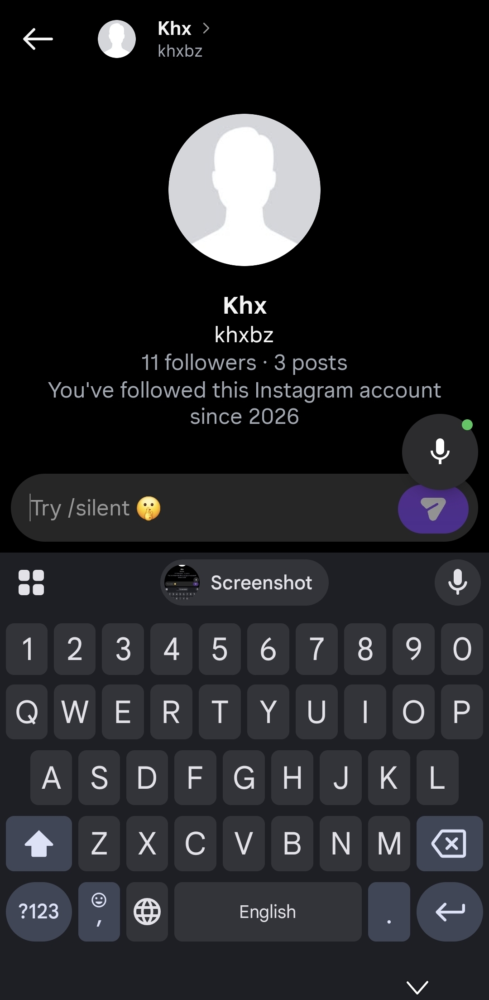
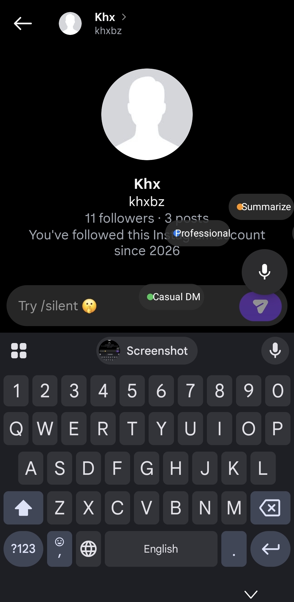

# Voisum

Voice to clean text. Record in supported social media apps on Android, get AI-polished output injected directly.

## How It Works

A floating bubble sits above your keyboard in supported social media apps. Tap it to record, tap again to stop. The audio goes to your chosen AI provider, comes back as polished text, and gets typed into the field automatically. An undo button shows for 4 seconds after each injection.

Long-press the bubble to switch between prompt presets: Casual DM, Professional, Summarize, Translate to English, or a custom one you define. All presets are editable in Settings.

You can also bind presets to specific apps. WhatsApp always uses Casual DM, Gmail always uses Professional, and so on. These per-app rules override manual selection.

## Screenshots

	
	
	
	
	

## Setup

Requires Android 8.0+ (API 26). Android 14 recommended.

1. Clone the repo and open it in Android Studio (Hedgehog 2023.1.1+, JDK 17)
2. Sync Gradle, connect a device with USB debugging, run the app
3. On first launch, the main screen walks you through four permissions: Accessibility Service, Overlay ("Display over other apps"), Microphone, and your AI provider API key

## AI Providers

**Gemini (Google):** Get a key from [Google AI Studio](https://aistudio.google.com/app/apikey). Free tier works. The app uses the `v1beta` endpoint because v1 has zero quota on free.

**ChatGPT (OpenAI):** Get a key from [OpenAI API Keys](https://platform.openai.com/api-keys). Requires a paid account with API credits. Uses Whisper for transcription and GPT-4o-mini for polishing.

**GitHub Copilot (GitHub Models):** Create a personal access token at [GitHub Settings > Tokens](https://github.com/settings/tokens) with `models:read` scope. This provider transcribes on-device via Android's SpeechRecognizer and sends only text to GitHub Models. Audio never leaves the device.

## Known Limitations

Banking and security apps block AccessibilityService. The bubble appears but injection fails silently. A clipboard fallback kicks in with a banner telling you to paste manually.

SpeechRecognizer quality (GitHub Copilot provider) varies by device. Some have poor offline models. Switch to Gemini or ChatGPT for server-side transcription if results are bad.

Keyboard detection uses the visible display frame. Custom or floating keyboards can report wrong heights, misplacing the bubble.

Xiaomi MIUI and Samsung OneUI add extra restrictions on overlays and background services. If the bubble does not appear, check battery optimization and autostart settings.

Android 13+ may require a separate notification permission grant for accessibility service status notifications.

Recording is capped at 20MB before upload, roughly 2 to 3 minutes depending on bitrate.

## Tech Stack

Kotlin, Min SDK 26 / Target SDK 34, Jetpack Compose for UI, Android View system for the overlay bubble, Material 3 with Dynamic Colors, Room for history, Retrofit 2 + OkHttp for API calls, EncryptedSharedPreferences for key storage, Gradle with Kotlin DSL.

## License

Private project. All rights reserved.
